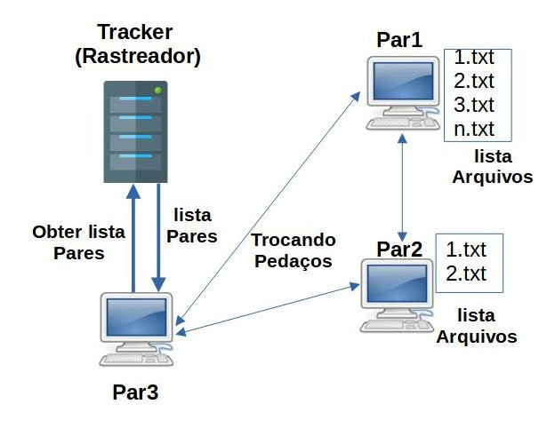
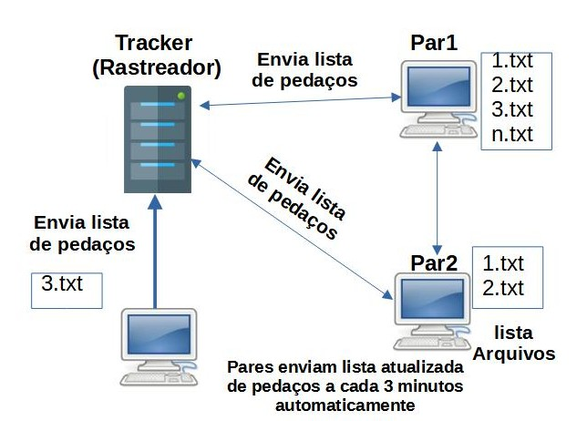

# Bittorrentish

## Introdução

  Projeto criado segundo trabalho final da disciplina de Redes de Computadores, no curso de Tecnologia em Análise e Desenvolvimento de Sistemas da Universidade do Estado de Santa Catarina (UDESC).
  A aplicação consiste em uma implementação dos aspectos e funcionamento básico do protocolo bittorrent, utilizado para compartilhamento de arquivos grandes entre vários computadores de maneira eficiente.

## Requisitos

  Deve ser implementado um programa que simuel o comportamento do protocolo BitTorrent, considerando os seguintes aspectos:
  * Os nós da rede estão participando da distribuição de um arquivo grande.
  * Um novo nó ao entrar na rede P2P deve contatar um Tracker (um servidor centralizado) e solicitar a
ele a lista de nós que fazem parte do torrent naquele momento. O Tracker entrega a lista de pares e os
pedaços que cada um tem. A conexão com o servidor é via o protocolo TCP.
  * O cliente recebe a lista (que deve conter no mínimo 2 outros pares), e deve solicitar o arquivo mais
raro primeiro a um outro par via conexão TCP. A lista deve conter o número IP de destino, porta de destino e
pedaços dos arquivos que o par tem.
  * O cliente escolhido deve enviar o pedaço do arquivo que foi solicitado. Neste momento, a conexão
entre o cliente e o outro nó (par) é P2P.
  * A cada 3 minutos os clientes enviam automaticamente a lista de pedaços do arquivo que
disponibilizam ao Rastreador (Tracker).

    
    

## Funcionamento

* O protocolo bittorrent é composto um servidor central e várias outras máquinas que se conectam ao servidor e entre si.
* O servidor é chamado de **Tracker**, enquanto as máquinas que se conectam são chamadas de **pares** ou **peers**.
* O Tracker é responsável por armazenar uma lista de todos os pares conectados e quais arquivos cada um possui.
* Um par, ao se conectar, envia uma requisição ao tracker, que responde com esta lista.
* Este par, então, consulta a lista e seleciona o arquivo mais raro, e faz uma requisição direta para a máquina que possui aquele arquivo específico.
* Têm-se, então, uma conexão P2P híbrida.
* A cada 10s, cada par envia uma mensagem de `ping` ao tracker, que significa que este par ainda está conectado.
* A cada 20s, cada par envia para o tracker uma lista dos arquivos que possui. O tracker, então, atualiza a própria lista.
* A cada 15s, o tracker faz uma limpeza da lista, de modo que pares  que não enviaram uma mensagem de ping desde a última limpeza serão retirados da lista.
* A cada 30s, pares que não possuem todos os arquivos:
  * Consultam a lista de arquivos que receberam do tracker, selecionam o arquivo mais raro
  * Selecionam aleatóriamente um dos pares que possuem esse arquivo
  * Abrem uma conexão direta com dado par e solicitam o arquivo
* Quando um par possui todos os arquivos listados:
  * Para de enviar solicitações de download
  * Continua enviando a lista de arquivos que possui para o tracker, para fins de tolerância a falhas por parte do tracker
  * Continua aceitando solicitações de download por parte de outros pares

* Uma máquina deve rodar o arquivo `server.py` o tempo todo. Esta máquina faz o papel do **Tracker**. O tracker é um servidor que guarda uma lista com as informações necessárias para conexão com outros pares (endereço IP e porta), assim como a lista de arquivos que cada par possui. O tracker não possui nenhuma parte do arquivo.
* Outras máquinas (sem número limite), rodam o arquivo `client.py`. Estas máquinas se conectarão ao tracker para receber a lista, e, posteriormente, a outros clientes para solicitar os pedaços do arquivo.
* Caso um par se desconecte, este será retirado da lista do tracker na próxima rodada de atualização da lista.

## Setup de testes
* Foi implementado um script em Shell para configurar e rodar um pequeno ambiente de testes do sistema, no qual serão criados 1 servidor e 4 clientes.
* O arquivo test.sh, portanto, cumpre as seguintes funções:
  * Cria um diretório de testes, que está listado no .gitignore
  * Copia os arquivos e cria cópias do `client.py`, modificando o conteúdo do mesmo de acordo com as necessidades de cada cliente.
  * De acordo com a presença ou ausência do parâmetro `tmux` ao rodar o script (como em `./test.sh tmux`):
    * Cria uma nova janela de terminal, instancia uma sessão de tmux e roda 1 servidor e 4 clientes, em uma organização intuitiva de painéis
    * Cria uma nova janela de terminal para o servidor e cada um dos clientes.

## Observação
* Por padrão, o servidor (`server.py`) roda em modo de desenvolvimento, aceitando diversas conexões com o mesmo IP e diferenciado-os por porta, para o contexto de que o desenvolvedor está rodando o servidor e clientes em sua mesma máquina.
* Para rodar o servidor em modo de "produção", no qual essa diferenciação é feita a partir do socket do cliente, ou seja, o conjunto IP + porta, basta subir o `server.py`, adicionando a flag `--remote` ao comando.

## Tecnologias

* [Python](https://www.python.org/)

## Aprenda mais

* [Especificação do protocolo BitTorrent](https://wiki.theory.org/BitTorrentSpecification)
* [Sockets em python](https://realpython.com/python-sockets/)
